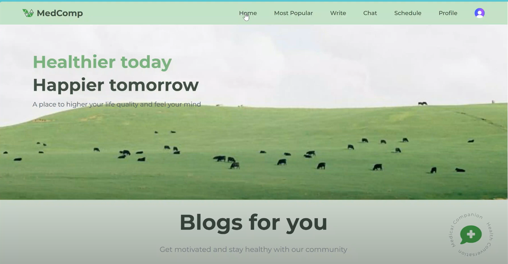
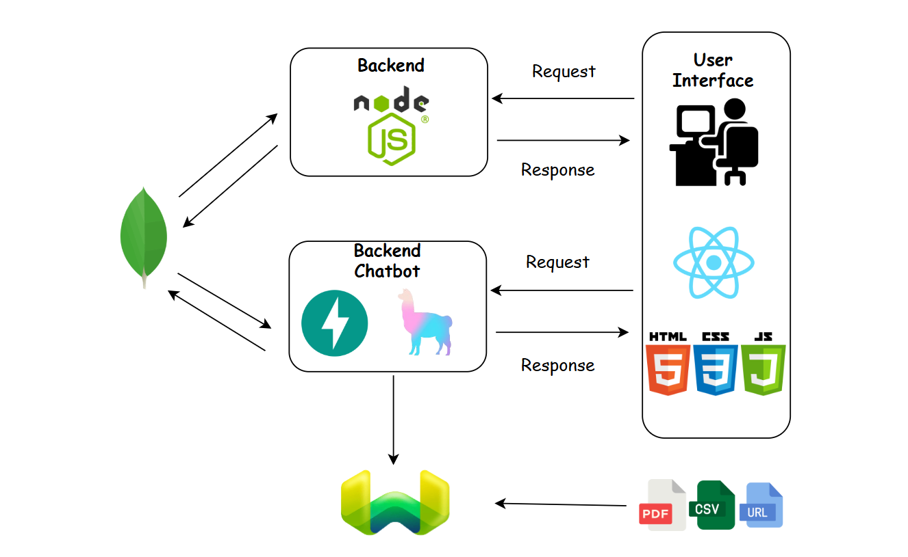
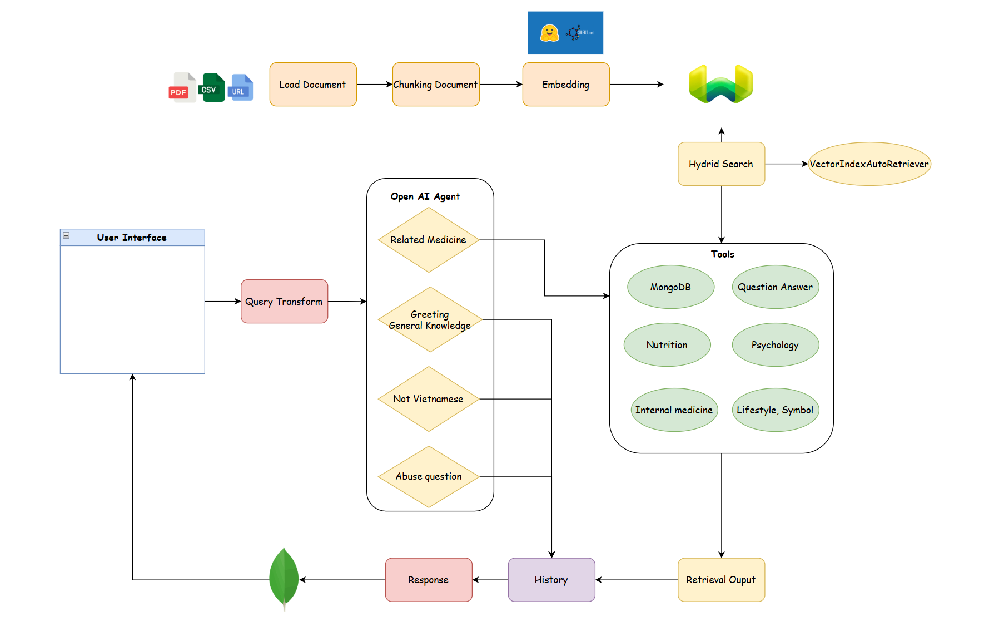

MedComp Assistant
============

MedComp Assistant is a health-focused, AI-powered assistant designed to provide accurate, reliable, and empathetic support to users of all ages, especially teenagers. With over 10 years of medical knowledge integrated into its system, MedComp aims to simplify complex health information into easy-to-understand advice while offering personalized care.

A web application and chatbot backend built using **Vite** for the frontend and backend and **FastAPI** for the chatbot backend.

[](https://opensource.org/licenses/MIT)


* * * * *

Table of Contents
-----------------

-   [Features](#features)
-   [Bot in Action](#bot-in-action)
-   [System Architecture Overview](#system-architecture-overview)
-   [Future Scope](#future-scope)
-   [Tech Stack](#tech-stack)
-   [Installation](#installation)
-   [Setting Up Environment Variables](#setting-up-environment-variables)
-   [Running the Project](#running-the-project)
    -   [Frontend](#frontend)
    -   [Backend](#backend)
-   [Build and Deployment](#build-and-deployment)
-   [Contributing](#contributing)
-   [License](#license)

* * * * *

Features
--------
> System Features
-   Users can share articles, tips, and experiences about 
-   A blog platform for people to exchange ideas and learn from others' experiences.
-   Users can create and manage schedules for:
    -   Medication reminders.
    -   Workout plans.
    -   Health checkups or doctor appointments.
- An intuitive interface to help users align their daily health plans
> Bot Features
-   Users can ask the chatbot any questions related to:
    -   Diseases and symptoms.
    -   Psychology and mental health.
    -   Nutrition advice for healthy living.
    -   Tips for improving lifestyle.
-   The chatbot analyzes user schedules and provides **personalized recommendations** to improve health and wellness.
-   Suggests optimized plans for fitness, meals, and mental well-being.
-   Provides **information about diseases**, their symptoms, prevention, and treatment options.
-   Answers questions in **easy-to-understand language**, avoiding medical jargon.
-   Offers personalized advice to help users maintain a healthy lifestyle.
-   Answers questions about food choices, fitness routines, and mental relaxation techniques.

* * * * *

Tech Stack
----------

-   **Frontend**: Vite, React
-   **Backend**: Express, FastAPI, Python 3.11
-   **Package Manager**: npm (for frontend and backend dependencies), pip (for chatbot backend dependencies)
-   **Database**: MongoDB

* * * * *

Bot in Action
------------
> Watch the below video to get a better idea on how bot works

[](https://www.youtube.com/watch?v=p2UKElI-zbA&t=11s "Video Title")

* * * * *

System Architecture Overview
----------
> Common System

> Chatbot System


* * * * *

Future Scope
----------
-   **Optimized Prompt and Tool Descriptions**

    -   Design more specific and effective prompts to enhance chatbot performance.
    -   Refine descriptions of tools to ensure clarity and usability.
-   **Admin Dashboard**

    -   Develop a dedicated dashboard for administrators to manage users, content, and system settings efficiently.
-   **Search for Missing Information**

    -   Enable the chatbot to search the Internet for missing information or provide guidance when it lacks data to respond accurately.
-   **Web Deployment**

    -   Deploy the web application for public access on platforms like Vercel, Netlify, or a dedicated server.
-   **Image and Voice Processing**

    -   Add support for users to upload images for analysis or interpretation.
    -   Implement voice interaction capabilities for queries and responses.
-   **Schedule Database Management**

    -   Introduce features for users to modify their schedules directly, such as deleting or updating entries in the database.
* * * * *

Installation
------------

### Prerequisites

-   **Node.js** (v16 or newer)
-   **Python 3.11**
-   **pip** for Python dependency management

### Steps

1.  Clone the repository:

    ```bash
    git clone https://github.com/dngan0365/HealthcareBlogChat
    cd HealthcareBlogChat

2.  Install dependencies:

    -   **Frontend**:

        ```bash
        cd client
        npm install

    -   **Backend**:

        ```bash
        cd backend
        npm install

    -   **Chatbot Backend**:
        ```bash
        cd chatbot-backend
        pip install -r requirements.txt

* * * * *

Setting Up Environment Variables
--------------------------------

1.  **Frontend**:

    -   Create a `.env` file in the `client` directory.
    -   Add your environment variables:
        ```env
        VITE_API_URL=http://localhost:3000
        VITE_IK_URL_ENDPOINT=your-vite-ik-url-endpoint
        VITE_IK_PUBLIC_KEY=your-vite-ik-public-key 
        VITE_IK_SECRET_KEY=your-vite-ik-secret-key
        VITE_CLERK_PUBLISHABLE_KEY=your-vite-clerk-publishable
        VITE_API_URL=your-vite-api-url
        VITE_GEMINI_PUBLIC_KEY=your-gemini-public
        LICENSE_KEY_SYNCFUSION=your-license-key-syncfusion
    - For IK (support images): [ImageKit](https://imagekit.io/docs/api-overview)
    - For Syncfusion (support schedule): [Syncfusion](https://www.syncfusion.com/downloads)
2.  **Backend**:

    -   Create a `.env` file in the `backend` directory.
    -   Add your environment variables:
        ```env
        MONGO=your-mongo-url
        CLIENT_URL="http://localhost:5173"
        CLERK_WEBHOOK_SECRET=your-webhook-secret
        CLERK_PUBLISHABLE_KEY=your-publishable-key
        CLERK_SECRET_KEY=your-clerk-secret-key
        IK_URL_ENDPOINT=your-ik-url-endpoint
        IK_PUBLIC_KEY=your-ik-public-key
        IK_PRIVATE_KEY=your-ik-private-key 
    - Mongo for database: [Mongo](https://www.mongodb.com/?msockid=0047e0678f906e71157cf5648ef66f2d)
    - Clerk for Authentication: [Cleark](https://clerk.com/)
    - IK fro images: [ImageKit](https://imagekit.io/docs/api-overview) 

3.  **Chatbot Backend**:

    -   Create a `api_keys.yaml` file in configs folder in the `chatbot-backend` directory.
    -   Add your environment variables:

        api_keys.yaml

        ```env
        openai:
            api_key: your-key
        weaviate:
            url: your-weaviate-url
            api_key: your-weaviate-api-key
        mongodb:
            url: your-mongo-url

4.  Ensure the `api_keys.yaml` files are listed in `.gitignore` to prevent them from being pushed to the repository.

* * * * *

Running the Project
-------------------

### Frontend

1.  Start the development server:

    ```bash
    cd client
    npm run dev

2.  Open your browser and visit: http://localhost:5173

### Backend

1.  Start the FastAPI server:

    ```bash
    cd backend
    npm start

2.  Open your browser and visit: http://localhost:3000

### Chatbot Backend

1.  Start the FastAPI server:

    ```bash
    cd backend
    cd src
    uvicorn backend.main:app --reload --host 0.0.0.0 --port 8000

2.  API documentation will be available at:

    -   Swagger UI
    -   ReDoc

* * * * *

Build and Deployment
--------------------

### Frontend

1.  Build for production:

    ```bash
    cd frontend
    npm run build

2.  The production-ready files will be in the `dist` folder.

### Backend

1.  Use a production-grade server like `gunicorn` or `uvicorn` with multiple workers:

    ```bash

    python -m backend.uvicorn main:app --host 0.0.0.0 --port 8000